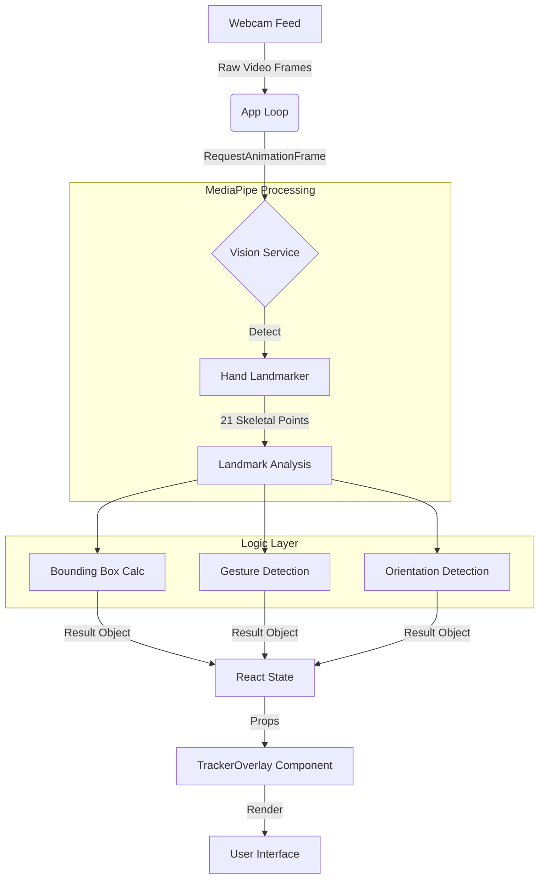

# Client-Side Hand Tracking & Mouse Interface

This project is a real-time, browser-based computer vision application that tracks a user's hand and interprets specific gestures to simulate mouse interactions.

It was originally built using server-side AI but was refactored to use **MediaPipe Tasks Vision** for ultra-low latency (60fps), privacy (no video upload), and high-precision coordinate tracking.

## 🌟 Key Features

1.  **Real-Time Tracking**: "Locks on" to the hand with a green bounding box.
2.  **Gesture Detection**: Distinguishes between an **OPEN** palm and a **CLOSED** fist.
3.  **Orientation Detection**: Determines if the **FRONT** (Palm) or **BACK** of the hand is facing the camera using 3D geometry.
4.  **Mouse Simulation logic**:
    *   **Left Click**: Closing a fist while showing the **Palm** (Cyan Overlay).
    *   **Right Click**: Closing a fist while showing the **Back** of the hand (Purple Overlay).
5.  **Motion Smoothing**: Handles frame synchronization and tracking loss with a grace period to prevent UI flickering.

---

## 🔄 The Data Flow

The application follows a strict unidirectional data flow, synchronized with the browser's refresh rate to ensure smooth rendering.

### Step-by-Step Pipeline

1.  **Input**: The `App.tsx` initializes the webcam stream via `navigator.mediaDevices.getUserMedia`.
2.  **Synchronization**: A `requestAnimationFrame` loop triggers roughly 60 times per second. It passes the current video video element to the `VisionService`.
3.  **Detection (`visionService.ts`)**:
    *   The `HandLandmarker` analyzes the pixel data.
    *   It returns 21 3D landmarks (x, y, z) representing the hand skeleton.
4.  **Logic Processing**:
    *   **Bounding Box**: Calculated by finding the min/max X and Y of all landmarks.
    *   **Gesture (Fist)**: The system calculates the Euclidean distance from the **Wrist** to the **Finger Tips** vs the **Wrist** to the **PIP Joints** (middle knuckles). If 3+ tips are closer to the wrist than their PIP joints, it is a **Fist**.
    *   **Orientation (Facing)**: The system calculates the **Cross Product** of two vectors (Wrist->Index and Wrist->Pinky). The Z-component of the result determines the winding order, revealing if the palm is facing forward or backward, regardless of hand rotation.
5.  **Rendering**: The results are stored in React State, triggering a re-render of the `TrackerOverlay`, which draws the box and labels (Green, Cyan, or Purple) based on the logic state.

---

## 🧠 Technical Implementation Details

### 1. Fist Detection (The "Click")
The gesture detection uses a robust geometric rule:
> *Is the finger tip closer to the wrist than the middle knuckle is?*

We use the **PIP (Proximal Interphalangeal) Joint** as the reference instead of the base knuckle. This allows the system to detect a fist even when viewing the back of the hand (where the finger tips are tucked underneath and hidden from view), enabling the "Right Click" feature.

### 2. Orientation Detection (Front vs Back)
Simple X-coordinate comparison (e.g., "Is thumb left of pinky?") fails if the user rotates their hand vertically.

Instead, we use Vector Math:
1.  Define Vector A: `IndexMCP - Wrist`
2.  Define Vector B: `PinkyMCP - Wrist`
3.  Calculate `CrossProduct(A, B)`

The sign (+/-) of the resulting Z-component tells us the direction the plane of the hand is facing relative to the camera.

---

## 🎨 Color Legend

| State | Color | Meaning |
| :--- | :--- | :--- |
| **Red** | 🔴 | Scanning / Acquiring Hand |
| **Green** | 🟢 | Tracking (Open Hand) |
| **Cyan** | 🔵 | **Left Click** (Fist + Palm Visible) |
| **Purple** | 🟣 | **Right Click** (Fist + Back of Hand Visible) |
